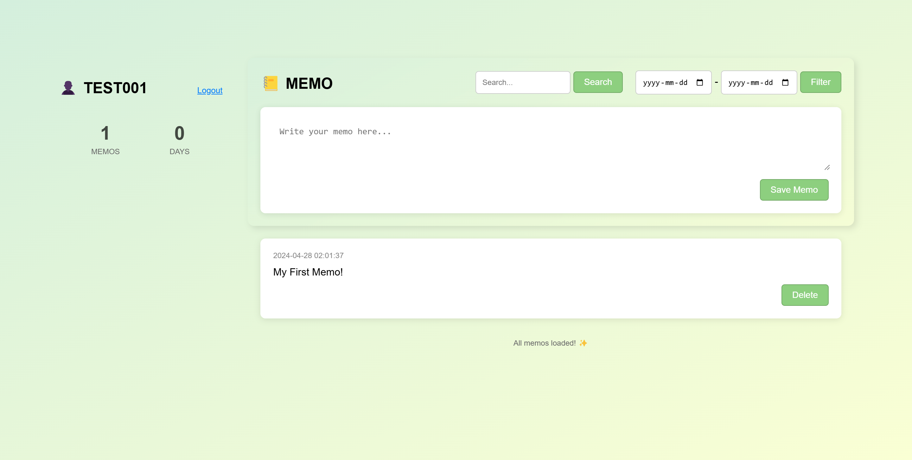

# Note Pad
A local hosted note-taking app using PHP.

This is a group project as an assignment of web programming course.

# Function Guide
  1. Authentication and Authorization:
     - Session Management: Ensure user is logged in and session variables are set.
     - Redirect to Login: If not logged in, redirect to the login page.

  2. User Interface:
     - Sidebar: Display user information and statistics.
     - Main Content: Show memos, search and filter options, and memo creation form.
  
  3. Memo Operations:
     - Saving Memo:
       Handle saving memos submitted via the memo creation form.
       Insert memo into the database associated with the current user.
     - Deleting Memo: Process memo deletion requests.
       Remove memo from the database while ensuring it belongs to the current user.
  
  4. Database Operations:
     - Database Connection: Establish connection to the MySQL database.
     - Data Retrieval: Fetch memos and user-related data from the database.
     - Data Manipulation: Insert, update, or delete data in the database.
  
  5. User Registration and Login:
     - Registration:
       Validate username uniqueness.
       Hash password securely before storing in the database.
       Redirect to login page upon successful registration.
     - Login:
       Verify user credentials against the database.
       Set session variables upon successful authentication.
       Redirect to the main memo page after login.
  
  6. Database Setup:
     - Database Creation: Create the 'notes' database if it doesn't exist.
     - User and Memo Tables: Define tables for storing user information and memos.
     - Foreign Key Constraint: Ensure referential integrity between user and memo tables.
